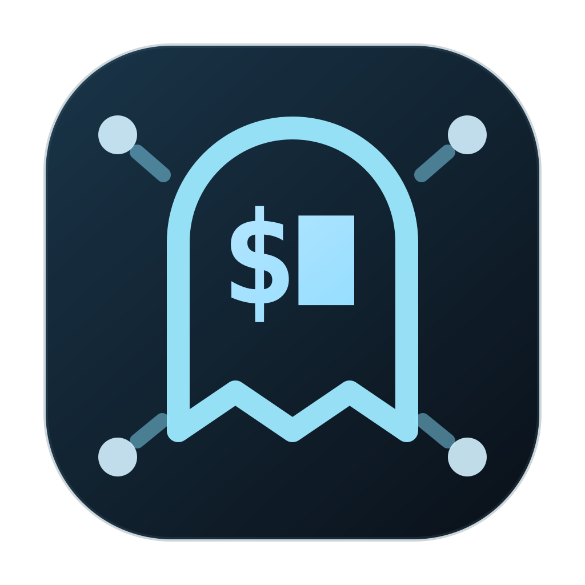
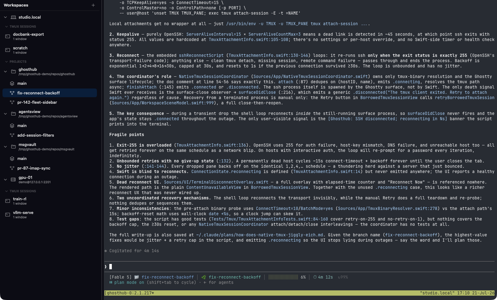

<p align="center">
  <a href="https://ghosthub.io">
    
  </a>
</p>

<h1 align="center">Ghosthub</h1>

<p align="center">
  <strong>A power terminal for your agents' tmux sessions.</strong>
  <br>
  Attach to every session in your fleet, local or over SSH, with keepalives,
  automatic reconnect, and worktree-aware navigation.
</p>

<p align="center">
  
  
  <a href="LICENSE">
    
  </a>
</p>

<p align="center">
  <a href="https://ghosthub.io"><strong>Website</strong></a>
  ·
  <a href="https://github.com/kenn-io/ghosthub/releases"><strong>Download</strong></a>
  ·
  <a href="https://discord.gg/nEB7VaAnU9"><strong>Discord</strong></a>
</p>

<p align="center">
  
</p>

Ghosthub gives developers one fast, native place to find and enter the terminal
sessions behind their projects and coding agents. It discovers the tmux
sessions you already have, keeps remote clients connected through ordinary
network interruptions, and makes switching between hosts, projects, and
worktrees feel immediate.

There is no proprietary session format and nothing to migrate. Tmux continues
to own windows, panes, layout, history, and process lifetime. Ghosthub is the
macOS interface that makes the whole fleet easy to navigate.

## Highlights

- **Every tmux session in one sidebar.** See local sessions, remote sessions,
  and worktree sessions together—even when they were created outside Ghosthub.
- **SSH that handles real life.** Keepalives and automatic reconnect let a
  remote tmux session survive Wi-Fi changes, sleep, and airplane mode.
- **Worktree-native navigation with
  [kwt](https://kwt.sh).** Kwt is a cross-platform Git
  worktree manager written in Go for tmux-backed development. Its projects and
  worktrees appear alongside ordinary tmux sessions, with exact
  workspace-to-session mapping.
- **Native tmux behavior.** Use the tmux window, pane, keybinding, history, and
  plugin setup you already trust. Closing Ghosthub detaches; it does not kill
  the session.
- **Powered by libghostty.** GPU-accelerated terminal rendering and Ghostty's
  configuration format, with an isolated Ghosthub-owned config.
- **Built for macOS.** A lightweight SwiftUI/AppKit application—no Electron
  and no background daemon.

## Install

Ghosthub currently requires:

- an Apple Silicon Mac
- macOS 26 (Tahoe) or newer
- `tmux` on each machine whose sessions you want to use

1. Download the latest notarized
   [Ghosthub DMG](https://github.com/kenn-io/ghosthub/releases).
2. Open the DMG and drag **Ghosthub** to **Applications**.
3. Launch Ghosthub. Future releases are delivered through the built-in
   automatic updater.

Install tmux on the local Mac with Homebrew if needed:

```sh
brew install tmux
```

Remote hosts only need working SSH access and tmux. Installing
[kwt](https://kwt.sh) remotely is optional unless you want
that host's projects and worktrees in the sidebar.

## Five-minute guide

### 1. Open a session

Launch Ghosthub and expand **Local**. Existing tmux sessions appear
automatically. Click any session to attach with a normal tmux client.

Use the **+** button beside a host to create a named tmux session when you want
a new one. Closing its Ghosthub presentation only detaches from tmux, so the
work keeps running.

### 2. Add an SSH host

Open **Settings** with <kbd>⌘</kbd><kbd>,</kbd>, choose **Hosts**, and press
**+**. Enter any destination accepted by your SSH configuration, such as:

```text
devbox
alice@build-server
server.example.com:2222
```

Use **Test Connection**, then close Settings. The host's tmux sessions will
appear in the sidebar. A temporarily unreachable host stays isolated; it does
not block local sessions or the rest of your fleet.

### 3. Add project and worktree context with kwt

[Kwt](https://kwt.sh) is a cross-platform Git worktree manager
written in Go for tmux-backed development and coding-agent workflows. The same
CLI runs on macOS and Linux, so it can supply workspace context on both the
local Mac and remote hosts while Ghosthub remains a native Swift macOS app.
Ghosthub ships with a pinned kwt helper for reliable local integration. To
register repositories or manage them from the command line, install the kwt
CLI:

```sh
go install go.kenn.io/kwt/cmd/kwt@latest
```

Run `kwt` once from a repository to register it:

```sh
cd ~/code/my-project
kwt
```

The project and its worktrees will appear under that host in Ghosthub. Select
a project and press <kbd>⌘</kbd><kbd>⇧</kbd><kbd>N</kbd> to create a new
worktree, or use **Quick Launch** to jump there without reaching for the mouse.

### 4. Make the terminal yours

Ghosthub reads its own configuration at:

```text
~/.config/ghosthub/ghostty.conf
```

The file uses
[Ghostty's configuration format](https://ghostty.org/docs/config/reference),
but remains separate from Ghostty.app so the two applications can evolve
independently. Appearance, keyboard, worktree, agent, and host preferences are
also available in **Settings**.

## Useful shortcuts

| Shortcut | Action |
| --- | --- |
| <kbd>⌘</kbd><kbd>⇧</kbd><kbd>P</kbd> | Open Quick Launch |
| <kbd>⌘</kbd><kbd>B</kbd> | Show or hide the sidebar |
| <kbd>⌘</kbd><kbd>⇧</kbd><kbd>N</kbd> | Create a worktree in the selected project |
| <kbd>⌘</kbd><kbd>,</kbd> | Open Settings |
| <kbd>⌘</kbd><kbd>W</kbd> | Detach the current presentation |

## How the pieces fit

**Tmux owns the session.** Ghosthub never rebuilds or replaces tmux windows,
panes, history, or process management.

**[Kwt](https://kwt.sh) owns worktree identity.** It tells
Ghosthub which projects and worktrees exist and the exact tmux session
associated with each workspace. Kwt is optional if you only want Ghosthub as a
local and remote tmux session switcher.

**Ghosthub owns the experience.** It discovers sessions, organizes the fleet,
presents native terminal clients, and supervises SSH keepalive and reconnect.

## Build from source

The packaged app is the easiest way to use Ghosthub. Contributors who want to
build it need macOS 26, Xcode 26, Zig, uv, and the Metal Toolchain. Start with
the [development quick start](docs/quickstart.md), then see
[CONTRIBUTING.md](CONTRIBUTING.md).

Architecture, security boundaries, terminal behavior, and release operations
are documented in [`docs/`](docs/README.md).

## License

Copyright 2026 Kenn Software LLC.

Ghosthub is free and open source software licensed under the
[GNU Affero General Public License v3.0](LICENSE).
